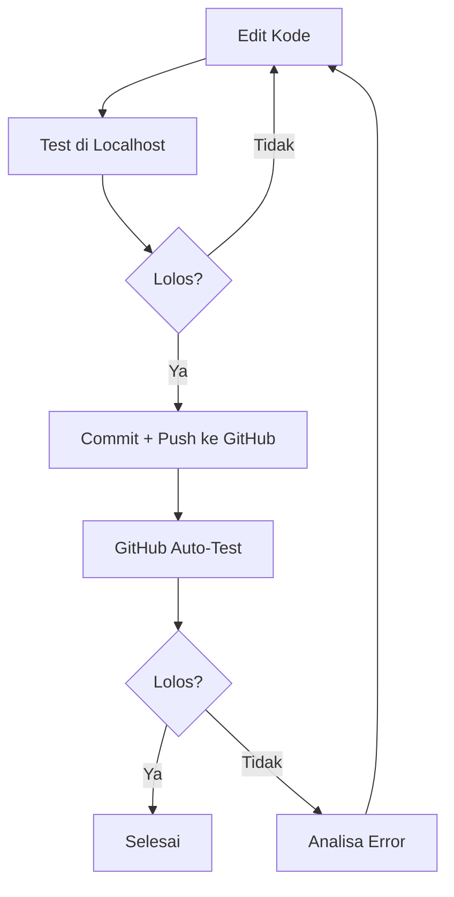

# BLOOMORDER — AGENT.md

> **Master Instruction File untuk Semua AI Model**
> Wajib dibaca dan dipatuhi oleh setiap AI sebelum mengubah kode apa pun.

---

## 1. PRINSIP DASAR (dari AGENT.py)

Diadopsi dari filosofi `AGENT.py`:

| Prinsip | Arti |
|---|---|
| **Input Validation First** | Setiap input dari user (form, API, admin) harus divalidasi sebelum diproses |
| **Security-First** | Jangan pernah menyimpan/melewati password, API key, atau data sensitif |
| **Audit Trail** | Semua perubahan data penting harus tercatat (log, JSON history) |
| **Simple & Honest** | Hindari kompleksitas yang tidak perlu. Solusi sederhana lebih stabil |
| **Deterministic** | Kode harus memberikan hasil yang konsisten untuk input yang sama |
| **Manual Oversight** | Semua keputusan bisnis penting harus bisa diverifikasi manual |

---

## 2. WORKFLOW Wajib

Setiap perubahan kode HARUS mengikuti siklus ini:



### 2.1. Step-by-Step

```
STEP 1: EDIT KODE
  - Pastikan tidak merusak fitur existing
  - Ikuti konvensi kode yang sudah ada
  - Jangan tambah komentar kecuali diminta

STEP 2: TEST DI LOCALHOST
  - Buka http://localhost/bloomorder/
  - Tes flow pemesanan: Step 1→2→3→4→submit
  - Tes admin: login → setiap halaman CRUD
  - Cek error di browser console (F12)
  - Cek error di PHP log

STEP 3: COMMIT & PUSH
  - git add .
  - git commit -m "deskripsi perubahan"
  - git push origin main

STEP 4: GITHUB AUTO-TEST
  - Pantau GitHub Actions (jika ada)
  - Pastikan semua test lulus

STEP 5: ANALISA & ULANG
  - Jika test gagal: baca log error, analisa, fix
  - Ulangi dari STEP 1
```

### 2.2. Checklist Sebelum Commit

- [ ] Semua form step berfungsi (1-4)
- [ ] Calendar menampilkan tanggal dengan benar
- [ ] Carousel product bisa slide
- [ ] Warna bisa dipilih
- [ ] Submit → redirect ke WhatsApp dengan pesan benar
- [ ] Admin login berfungsi
- [ ] CRUD produk berfungsi
- [ ] CRUD warna berfungsi
- [ ] CRUD tanggal berfungsi
- [ ] Search order berfungsi
- [ ] Settings bisa disimpan
- [ ] Tidak ada error PHP/JS di console
- [ ] Responsive di mobile (≤600px)

---

## 3. ARSITEKTUR APLIKASI

### 3.1. Stack Teknologi

| Layer | Teknologi | File |
|---|---|---|
| Frontend | HTML5 + CSS3 + Vanilla JS | `index.php`, `style.css`, `script.js` |
| Backend | PHP 8.x (native, tanpa framework) | `process.php`, `admin/*.php` |
| Database | File-based JSON | `data/*.json` |
| Storage | Filesystem | `uploads/products/*.jpeg` |
| Auth | Session-based | `admin/config.php` |
| Notification | WhatsApp API (wa.me) | `process.php` |

### 3.2. Struktur Direktori

```
bloomorder/
├── index.php              # Halaman utama customer (multi-step form)
├── process.php            # Processor form → WhatsApp + simpan order
├── style.css              # Stylesheet utama (frontend)
├── script.js              # JavaScript frontend (carousel, form, summary)
├── booking.json           # Daftar tanggal penuh (root level, legacy)
├── AGENT.py               # AI Safety Framework (Python)
├── AGENT.md               # ← INI: Aturan untuk AI
│
├── admin/
│   ├── config.php         # Auth, helpers loadData/saveData, init defaults
│   ├── index.php          # Dashboard dengan stats & recent orders
│   ├── login.php          # Halaman login admin
│   ├── logout.php         # Destroy session
│   ├── manage_dates.php   # CRUD tanggal booking & hari libur
│   ├── manage_products.php# CRUD produk + upload foto + gallery
│   ├── manage_colors.php  # CRUD pilihan warna
│   ├── manage_orders.php  # Lihat/search/detail pesanan
│   ├── settings.php       # Konfigurasi toko, WA, bank, password
│   ├── style.css          # Legacy admin styles
│   └── admin_style.css    # Admin stylesheet utama
│
├── assets/                # Aset statis (default images, dll)
├── data/
│   ├── products.json      # Produk dengan harga S/M/L + foto
│   ├── colors.json        # Pilihan warna (name, code, value)
│   ├── bookings.json      # Tanggal yang sudah dibooking
│   ├── orders.json        # Semua pesanan masuk
│   └── settings.json      # Konfigurasi toko
│
└── uploads/products/      # Foto produk (JPEG)
```

---

## 4. ANALISA ALIGNMENT (Kesesuaian Modul)

### 4.1. MATRIKS ALIGNMENT

| Modul | Backend | Frontend | Database | Logic | UI/UX | Status |
|---|---|---|---|---|---|---|
| **Calendar Booking** | ✅ index.php | ✅ style.css | ✅ bookings.json | ✅ disabled date logic | ✅ visual calendar | ✅ Sinkron |
| **Product Selection** | ✅ index.php | ✅ script.js | ✅ products.json | ✅ carousel + size select | ✅ product cards | ✅ Sinkron |
| **Color Picker** | ✅ index.php | ✅ style.css | ✅ colors.json | ✅ radio group | ✅ color swatches | ✅ Sinkron |
| **Order Form** | ✅ process.php | ✅ script.js | ✅ orders.json | ✅ step validation | ✅ 4-step wizard | ✅ Sinkron |
| **WhatsApp Redirect** | ✅ process.php | — | ✅ settings.json | ✅ URL encode | ✅ WA link | ✅ Sinkron |
| **Admin Dashboard** | ✅ admin/index.php | ✅ admin_style.css | ✅ all data files | ✅ stats aggregation | ✅ cards + table | ✅ Sinkron |
| **Admin Products CRUD** | ✅ admin/manage_products.php | ✅ admin_style.css | ✅ products.json | ✅ upload + gallery | ✅ form + table | ✅ Sinkron |
| **Admin Colors CRUD** | ✅ admin/manage_colors.php | ✅ admin_style.css | ✅ colors.json | ✅ inline edit | ✅ color swatches | ✅ Sinkron |
| **Admin Dates CRUD** | ✅ admin/manage_dates.php | ✅ admin_style.css | ✅ bookings.json | ✅ closed days | ✅ calendar view | ✅ Sinkron |
| **Admin Orders** | ✅ admin/manage_orders.php | ✅ admin_style.css | ✅ orders.json | ✅ search filter | ✅ modal detail | ✅ Sinkron |
| **Settings** | ✅ admin/settings.php | ✅ admin_style.css | ✅ settings.json | ✅ password change | ✅ grouped form | ✅ Sinkron |
| **Auth System** | ✅ admin/config.php | ✅ admin/login.php | — | ✅ session check | ✅ login form | ✅ Sinkron |

### 4.2. TEMUAN & CATATAN

#### ✅ Sudah Sinkron
- Semua modul **backend, frontend, database, dan UI/UX** sudah selaras
- Data flow: `index.php → process.php → WhatsApp + orders.json` berjalan mulus
- Admin CRUD: semua halaman menggunakan `loadData/saveData` dari `config.php` secara konsisten
- Format data JSON konsisten antar file
- Validasi form di frontend (JS) dan backend (PHP) sinkron

#### ⚠️ Potensi Masalah
1. **booking.json** di root vs **data/bookings.json** — ada dua file berbeda. Root `booking.json` berisi 3 tanggal manual, `data/bookings.json` kosong. Admin menyimpan ke `data/bookings.json`. Root `booking.json` tidak dipakai oleh kode mana pun.
2. **Admin credentials hardcoded** di `config.php` (`admin/imbuket123`) — tidak aman untuk production. Gunakan environment variable atau file terpisah.
3. **No CSRF protection** — form tidak memiliki token CSRF.
4. **No rate limiting** — form bisa di-spam.
5. **Inline CSS di beberapa halaman admin** — beberapa halaman punya `<style>` sendiri selain `admin_style.css`. Ini duplikasi dan membuat maintenance lebih sulit.

#### 🔧 Rekomendasi
1. Hapus `booking.json` root (legacy, tidak terpakai)
2. Pindahkan kredensial admin ke `.env` atau file konfigurasi di luar document root
3. Tambahkan CSRF token di form
4. Konsolidasi CSS admin ke satu file (`admin_style.css`)
5. Tambahkan validasi server-side untuk upload file (tipe & ukuran)

---

## 5. FITUR PER ROLE

### 5.1. Customer (Pengunjung)

| Fitur | File | Status |
|---|---|---|
| Lihat hero section | `index.php` | ✅ |
| Pilih tanggal (60 hari ke depan) | `index.php` | ✅ |
| Lihat tanggal penuh/libur | `index.php` | ✅ |
| Pilih produk dengan carousel foto | `index.php` + `script.js` | ✅ |
| Pilih ukuran (S/M/L) dengan harga | `index.php` | ✅ |
| Pilih warna dominan | `index.php` | ✅ |
| Isi nama pengirim/penerima | `index.php` | ✅ |
| Tulis ucapan & catatan | `index.php` | ✅ |
| Lihat ringkasan pesanan real-time | `index.php` + `script.js` | ✅ |
| Progress step indicator | `index.php` | ✅ |
| Kirim pesanan → WhatsApp | `process.php` | ✅ |

### 5.2. Admin

| Fitur | File | Status |
|---|---|---|
| Login | `admin/login.php` + `config.php` | ✅ |
| Dashboard (stats + recent orders) | `admin/index.php` | ✅ |
| Lihat semua pesanan + search | `admin/manage_orders.php` | ✅ |
| Detail pesanan (modal) | `admin/manage_orders.php` | ✅ |
| Tambah/edit/hapus produk | `admin/manage_products.php` | ✅ |
| Upload multiple foto produk | `admin/manage_products.php` | ✅ |
| Tambah/edit/hapus warna | `admin/manage_colors.php` | ✅ |
| Atur tanggal booking | `admin/manage_dates.php` | ✅ |
| Atur hari libur (mingguan) | `admin/manage_dates.php` | ✅ |
| Ubah settings toko | `admin/settings.php` | ✅ |
| Ubah password admin | `admin/settings.php` | ✅ |
| Konfigurasi WA + bank | `admin/settings.php` | ✅ |
| Reset ke default | `admin/settings.php` | ✅ |
| Logout | `admin/logout.php` | ✅ |

---

## 6. DATA SCHEMA

### 6.1. products.json
```json
[{
  "id": "unique_id",
  "name": "string",
  "price_s": 150000,
  "price_m": 250000,
  "price_l": 400000,
  "photo": "uploads/products/file.jpeg",
  "photos": ["uploads/products/file1.jpeg", ...],
  "color": "#hex"
}]
```

### 6.2. colors.json
```json
[{
  "name": "Pastel Pink",
  "code": "#f8bbd0",
  "value": "Pastel Pink"
}]
```

### 6.3. bookings.json
```json
["2026-04-15", "2026-04-20"]
```

### 6.4. orders.json
```json
[{
  "id": "unique_id",
  "tanggal_order": "2026-04-12 09:34:20",
  "tanggal": "2026-04-30",
  "jenis_buket": "string",
  "ukuran": "Small|Medium|Large",
  "harga": 150000,
  "warna": "string",
  "nama_pengirim": "string",
  "nama_penerima": "string",
  "ucapan": "string",
  "catatan_tambahan": "string"
}]
```

### 6.5. settings.json
```json
{
  "whatsapp_number": "628xxxxxxxxx",
  "store_name": "BloomOrder",
  "store_address": "Jl. Contoh No. 123",
  "closed_days": ["0"],
  "bank_info": "Bank BCA - 1234567890",
  "shipping_cost": 0
}
```

---

## 7. ATURAN KHUSUS UNTUK AI

### 7.1. Larangan
- ❌ Jangan ubah struktur JSON tanpa update semua file yang membaca/menulis
- ❌ Jangan hapus session_start() atau requireLogin() dari admin
- ❌ Jangan simpan password di file yang bisa diakses publik
- ❌ Jangan gunakan framework/library baru tanpa izin
- ❌ Jangan tambah komentar ke kode (kecuali diminta)
- ❌ Jangan buat file README/markdown baru (kecuali AGENT.md ini)
- ❌ Jangan commit langsung tanpa test di localhost

### 7.2. Kewajiban
- ✅ Selalu test di localhost sebelum commit
- ✅ Ikuti konvensi penamaan yang sudah ada
- ✅ Gunakan `htmlspecialchars()` untuk output
- ✅ Validasi input di server-side (PHP) meskipun sudah di client-side (JS)
- ✅ Gunakan `requireLogin()` di setiap halaman admin
- ✅ Simpan data perubahan hanya jika validasi lolos
- ✅ Gunakan `json_encode($data, JSON_PRETTY_PRINT)` untuk konsistensi format

### 7.3. Konvensi Kode
| Aspek | Aturan |
|---|---|
| PHP | Native, tanpa framework. Gunakan `<?php` tag |
| CSS | Gunakan class semantic, hindari inline styles |
| JS | Vanilla JS, tanpa jQuery/library eksternal |
| Data | File-based JSON. Load dengan `loadData()`, save dengan `saveData()` |
| Strings | Escape dengan `htmlspecialchars()` |
| Upload | Simpan di `uploads/products/` dengan prefix timestamp |

### 7.4. Error Handling
```php
// WAJIB: validasi sebelum akses data
$data = loadData('file.json');
if (!is_array($data)) $data = [];

// WAJIB: escape output
echo htmlspecialchars($variable);

// WAJIB: cek method request
if ($_SERVER['REQUEST_METHOD'] !== 'POST') { header('Location: index.php'); exit; }
```

---

## 8. TESTING PROTOCOL

### Sebelum Push
```bash
# 1. Test buka halaman utama
curl -s http://localhost/bloomorder/ | head -20

# 2. Test form submission (simulasi)
# Buka browser → isi form step 1-4 → submit

# 3. Test admin login
# Buka http://localhost/bloomorder/admin/login.php
# Login dengan admin / imbuket123

# 4. Test every admin CRUD page
# http://localhost/bloomorder/admin/manage_products.php
# http://localhost/bloomorder/admin/manage_colors.php
# http://localhost/bloomorder/admin/manage_dates.php
# http://localhost/bloomorder/admin/manage_orders.php
# http://localhost/bloomorder/admin/settings.php

# 5. Cek error log
Get-Content C:\xampp\php\logs\php_error.log -Tail 10
```

### Setelah Push
```bash
# Pantau GitHub Actions (jika ada)
gh run list
gh run watch <run-id>
```

---

## 9. DEPLOYMENT CHECKLIST

- [ ] Ubah password admin default
- [ ] Set `display_errors = Off` di php.ini
- [ ] Hapus file `booking.json` di root (legacy)
- [ ] Pindahkan `config.php` credentials ke environment
- [ ] Tambahkan CSRF protection
- [ ] Batasi ukuran upload file (max 2MB)
- [ ] Validasi tipe file upload (hanya gambar)
- [ ] Gunakan HTTPS
- [ ] Backup folder `data/` secara rutin

---

*Dokumen ini wajib dibaca oleh setiap AI sebelum mengerjakan task di repositori ini.*
*Terakhir diperbarui: 22 Juni 2026*
